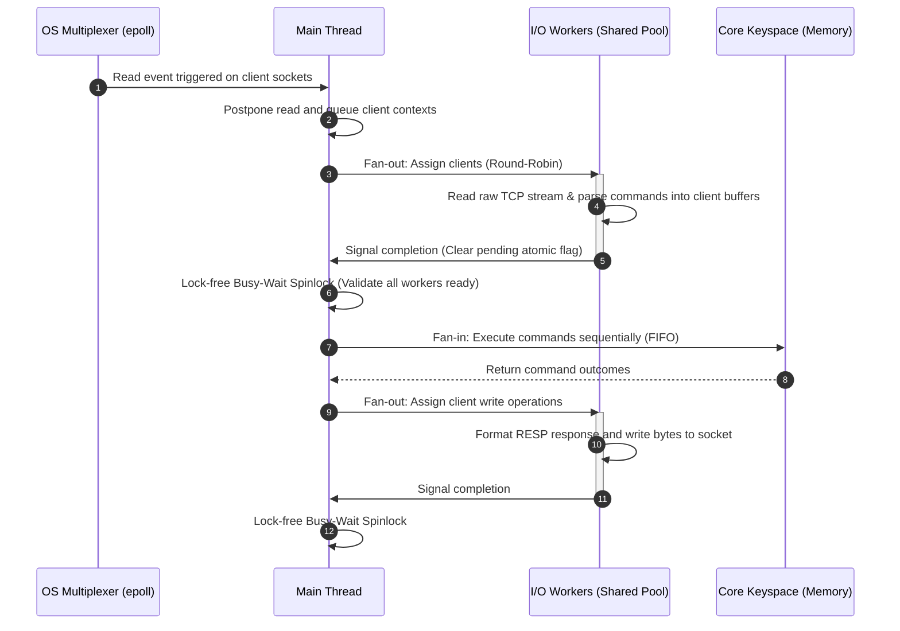
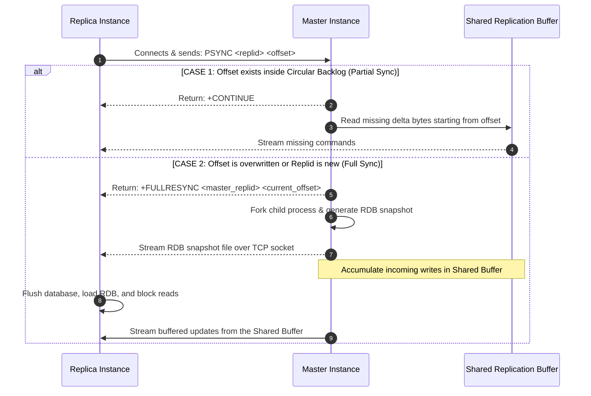

# Redis Systems Architecture Reference Manual

---

### Reference Architecture Directory

| Section | Target Component | Core Logic & Features |
| :--- | :--- | :--- |
| **[1. Core Foundations (Keyspace & Commands)](#1-core-foundations)** | Key-Value Storage | redisDb representation, redisObject encapsulation, SDS, and lookup flow [codeburst.io] |
| **[2. Thread Management & Core Execution](#2-thread-management)** | Main Event Loop & Thread Pools | Single-Threaded Core Engine, Multi-Threaded I/O, Synchronization Barrier [dragonflydb.io, strikefreedom.top] |
| **[3. Persistence Architectures](#3-persistence-architectures)** | Storage Layer | Point-in-Time RDB, Multi-Part AOF, Durability Policies [redis.io] |
| **[4. Standard Replication & PSYNC](#4-replication-psync)** | Node-to-Node Data Transfer | Asynchronous Handshakes, Replication Offsets, Shared Buffer [systeminternals.dev, redisgate.jp] |
| **[5. Replication Topologies & Routing](#5-replication-topologies)** | Distributed Architecture | Active-Passive Read/Write Splitting, Multi-Region Active-Active [oneuptime.com, redis.io] |
| **[6. Read-Write Consistency Guarantees](#6-consistency-guarantees)** | Data Safety Layer | Stale-Read Solutions, WAIT, WAITAOF, Split-Brain Protection [redisgate.jp] |
| **[7. Node Health & Topology Heartbeats](#7-health-monitoring)** | Cluster Coordination | PING-PONG, REPLCONF ACK Pipeline [redisgate.jp] |
| **[8. Appendix: Auxiliary Technologies](#8-appendix)** | Non-Redis Protocols | [I/O Multiplexing](#app-multiplexing), [DNS Anycast](#app-anycast), [BGP](#app-bgp), [Spinlocks vs Mutexes](#app-spinlocks), [Vector Clocks](#app-vclocks), [Copy-on-Write](#app-cow) |

---

<a id="1-core-foundations"></a>
### 1. Core Foundations (Keyspace & Commands)

To understand how Redis achieves rapid data operations ($O(1)$ average complexity for most lookups), we must first analyze its internal memory layout and keyspace design [codeburst.io].

#### The Database Internal Representation
```
                     ┌────────────────── redisDb ──────────────────┐
                     │                                             │
                     ├── dict (Main Keyspace)                      └── expires (TTL Space)
                     │    └── dictht [ht[0]]                           └── dictht [ht[0]]
                     │         └── dictEntry                                └── dictEntry
                     │              ├── Key (SDS String)                         ├── Key (SDS String)
                     │              └── Value (redisObject)                      └── Value (Expiry Timestamp)
```

#### Under the Hood Mechanics
1. **The Database Structure (`redisDb`):** Every Redis database is tracked by a C-language structure called `redisDb` [codeburst.io]. It contains two primary hash tables [codeburst.io]:
   * **`dict` (The Main Keyspace):** Maps a string key to a values payload container (`redisObject`) [codeburst.io].
   * **`expires` (The Expiry Dictionary):** Maps a string key to a 64-bit absolute UNIX epoch millisecond timestamp representing its Time-To-Live (TTL). Keys without an explicit TTL do not populate this table, which minimizes memory waste.
2. **Simple Dynamic Strings (SDS):** Keys are never stored as raw C null-terminated strings. Redis wraps them in an **SDS (Simple Dynamic String)** header that explicitly tracks string length and remaining buffer space. This prevents buffer overflows and allows $O(1)$ string length checks.
3. **The Hash Table Dictionary (`dict`):** 
   * Each dictionary contains an array of two hash tables (`ht[0]` and `ht[1]`) to facilitate **Incremental Rehashing**. If the load factor becomes too high, Redis slowly migrates entries from `ht[0]` to `ht[1]` over successive read/write command iterations to avoid blocking the server.
   * Collisions are handled using **Separate Chaining** (linked lists linked via `dictEntry->next` pointers).
4. **The Redis Object Container (`redisObject`):** Every database value is wrapped in a `redisObject` header [codeburst.io]:
   * **`type`:** Defines the user-facing data type (String, List, Hash, Set, Sorted Set) [codeburst.io].
   * **`encoding`:** Defines the physical C data structure used in RAM [codeburst.io] (e.g., small lists use a memory-packed `listpack`, while large lists transition to a pointer-linked `quicklist`).
   * **`ptr`:** Points to the actual allocated memory location of the underlying data structure [codeburst.io].

#### How Commands Traverse the Keyspace
When a client executes a command (e.g., `SET key val` or `HSET hash field val`):
1. The request is read, parsed, and stored as an array of SDS strings in `client->argv` [strikefreedom.top].
2. Redis performs a hash lookup on the key using the **MurmurHash2** algorithm, finding the active bucket inside `ht[0]`.
3. Before executing the operation, it evaluates the key's state in the `expires` dictionary. If the TTL has passed, the key is lazily deleted on the spot.
4. If valid, Redis modifies the target structure pointed to by `redisObject->ptr` [codeburst.io] or allocates a new dictionary node if the key is new.

---

<a id="2-thread-management"></a>
### 2. Thread Management & Core Execution

The core of Redis is designed around a single-threaded execution model to ensure absolute atomicity, maximize cache efficiency, and eliminate locking overhead [dragonflydb.io]. To scale with modern networks, high-cost network parsing tasks are offloaded to background helper threads without modifying the sequential execution pipeline [strikefreedom.top].

#### The Multi-Threaded I/O Pipeline


#### Under the Hood Mechanics
1. **Event Multiplexing:** The main thread executes an event loop (`aeMain`) driven by [I/O Multiplexing (epoll)](#app-multiplexing) [dragonflydb.io].
2. **Client Postponement:** When network packets land on client sockets, the main thread does not read them [strikefreedom.top]. Instead, it bypasses the system call and registers the client in a pending list (`clients_pending_read`) [strikefreedom.top].
3. **Work Distribution:** During the event loop's boundary stage (`beforeSleep`), the main thread distributes the clients from `clients_pending_read` to the I/O helper threads using a round-robin model [strikefreedom.top].
4. **Parallel Processing:** The worker threads wake up, execute raw `read` system calls, and parse the RESP (Redis Serialization Protocol) payload directly into each client's private query buffer [strikefreedom.top]. They do not touch the keyspace [strikefreedom.top].
5. **Synchronization Barrier:** The main thread processes its own partition, then enters a high-performance, lock-free [Spinlock](#app-spinlocks) loop over the atomic variables `io_threads_pending[thread_id]` until all worker tasks hit zero [strikefreedom.top].
6. **Safe Execution:** Once the barrier is resolved, the main thread iterates over the client list and executes the fully parsed commands sequentially (FIFO) against the database keyspace [strikefreedom.top].
7. **Write Offloading:** Responses are written to client buffers, then worker threads write the formatted bytes back to client sockets [strikefreedom.top].

#### Why the Synchronization Barrier is Required (Core Logic)
The lock-free spinlock barrier is logically mandatory to enforce three core invariants before any database mutations begin [strikefreedom.top]:

* **Command Ordering:** Client connections are pinned to specific I/O threads [strikefreedom.top]. The barrier guarantees that all pipelined commands from each client are fully parsed and "frozen" in their exact chronological sequence before execution [strikefreedom.top]. Without it, concurrent parsing would allow commands from different clients to slip past each other, destroying transactional consistency and deterministic execution.
* **Race Prevention:** The barrier ensures all background threads are completely idle during the execution phase [strikefreedom.top]. Because only the main thread is active, it can modify keyspaces and global metrics with absolute safety, completely eliminating the need for database locks or mutexes [dragonflydb.io, strikefreedom.top].
* **Allocator Isolation:** Both parsing (resizing buffers) and executing (allocating keys) require heavy memory allocation [strikefreedom.top]. Separating these steps with a barrier prevents background thread allocations from colliding with main thread allocations in the system memory allocator (`Jemalloc`), avoiding lock contention and maintaining high throughput [strikefreedom.top].

#### Advantages and Trade-offs
* **Advantages:**
  * Bypasses the need for multi-threaded locking architectures inside the in-memory keyspace [dragonflydb.io].
  * Enables a single core to saturate high-bandwidth network links (10Gbps+) by delegating protocol parsing [dragonflydb.io].
* **Trade-offs:**
  * Any slow, blocking operation (e.g., `KEYS`, huge O(N) operations, or slow Lua scripts) blocks the event loop, instantly stalling the entire server [dragonflydb.io].
  * Spin-waiting I/O workers cause elevated CPU consumption even under low traffic [strikefreedom.top].

#### Version Constraints
* **Single-threaded Core:** `v1.0+` [dragonflydb.io].
* **Multi-threaded Network I/O:** `v6.0+` (Disabled by default; configured via `io-threads` and `io-threads-do-reads`) [dragonflydb.io].

---

<a id="3-persistence-architectures"></a>
### 3. Persistence Architectures

To ensure durability across restarts and crash recovery, Redis utilizes two distinct persistence models: point-in-time snapshots and change-logging files [redis.io].

```
                  ┌─────────────── Redis Memory ───────────────┐
                  │                                            │
                  ▼ (forks child)                              ▼ (appends changes)
         [ RDB Snapshotting ]                         [ AOF Transaction Logging ]
                  │                                            │
                  ▼                                            ▼
           [ binary.rdb ]                            [ Multi-Part AOF Directory ]
      (Compressed Point-In-Time)                               │
                                            ┌──────────────────┼──────────────────┐
                                            ▼                  ▼                  ▼
                                     [ base.rdb ]       [ incremental.aof ]  [ manifest ]
```

#### Under the Hood Mechanics
* **RDB Snapshotting:**
  1. The master executes a `fork()` system call to spawn a child process [redis.io].
  2. The child process reads the memory state and serializes it into a highly compressed, single-file binary structure (`dump.rdb`) [redis.io].
  3. This process relies on OS [Copy-on-Write (COW)](#app-cow) memory pages [redis.io]. Memory page duplications occur only if the main thread writes to a page while the child is writing the snapshot [redis.io].
* **AOF Transaction Logging:**
  1. Every write command executed by the main thread is appended in RESP text format to an internal AOF buffer in memory [redis.io].
  2. This buffer is flushed to the OS file cache and synchronized to disk according to the configured `appendfsync` policy [redis.io]:
     * `always`: Flushes to disk after every client command. Highly durable, but throttles performance [redis.io].
     * `everysec`: Flushes exactly once per second via a background thread. Balance of performance and safety [redis.io].
     * `no`: Delegates flush timing to the OS file system buffer [redis.io].
* **Multi-Part AOF (MP-AOF):**
  1. Modern Redis splits the AOF into a directory structure consisting of three distinct file types [redis.io]:
     * **Base File:** A binary RDB snapshot representing the state of the database at the start of the compaction cycle [redis.io].
     * **Incremental Files:** Plaintext append-only logs tracking changes since the base file was generated.
     * **Manifest File:** A tracking index coordinating base and incremental sequences.
  2. This design resolves legacy AOF rewrite spikes, where compacting a single massive file created severe CPU and disk I/O bottlenecks [redis.io].

#### Advantages and Trade-offs
* **Advantages:**
  * RDB offers extremely fast recovery times since loading a raw memory dump requires no command execution [redis.io].
  * MP-AOF isolates incremental log writing from base snapshots, eliminating disk I/O latency spikes [redis.io].
* **Trade-offs:**
  * RDB is vulnerable to data loss between snapshot intervals [redis.io].
  * AOF configured with `appendfsync always` limits throughput to disk I/O write limits [redis.io].

#### Version Constraints
* **RDB and Legacy Single-File AOF:** `v1.0+`.
* **Multi-Part AOF (MP-AOF):** `v7.0+` [redis.io].

---

<a id="4-replication-psync"></a>
### 4. Replication Protocol (PSYNC)

Replication coordinates node data streams to enable scale-out reads and warm-standby high availability [oneuptime.com].

#### Under the Hood Mechanics
* **Offset-Driven Tracking:** The replication stream tracks state using two variables [systeminternals.dev]:
  1. **Replication ID (`replid`):** A unique, pseudo-random string identifying the dataset's lineage [systeminternals.dev].
  2. **Replication Offset (`offset`):** A 64-bit byte-counter tracking data progress [systeminternals.dev]. Every byte generated by the master increments this offset [systeminternals.dev].

* **The Handshake Protocol (`PSYNC`):**
  When a replica establishes a connection to a master, it issues the following command [systeminternals.dev]:
  $$\text{PSYNC } \langle\text{replid}\rangle \text{ } \langle\text{offset}\rangle$$



* **Global Shared Replication Buffer:**
  1. Under the hood, the circular backlog and all active replicas share a single chain of linked memory blocks (`replBufBlock`) [redisgate.jp].
  2. Each block maintains a reference counter (`refcount`) [redisgate.jp]. 
  3. Instead of copying data, each replica client maintains a pointer referencing its current read position in this shared chain [redisgate.jp].
  4. Once all active replicas and the backlog's oldest retained offset move past a block, its `refcount` falls to zero, and the memory is freed [redisgate.jp].

#### Advantages and Trade-offs
* **Advantages:**
  * The Shared Replication Buffer prevents master Out-Of-Memory (OOM) crashes when managing multiple slow replicas [redisgate.jp].
  * Partial synchronizations allow network hiccups to resolve with minimal bandwidth impact [systeminternals.dev].
* **Trade-offs:**
  * Full synchronization triggers a memory-intensive master `fork()`, resulting in copy-on-write overhead [systeminternals.dev].
  * Replicas must flush their entire database and block reads while loading a new RDB file [arpitbhayani.me].

#### Version Constraints
* **Replication Core:** `v1.0+`.
* **PSYNC v2:** `v4.0+`.
* **Shared Replication Buffer:** `v7.0+` [redisgate.jp].

---

<a id="4-replication-topologies"></a>
### 5. Replication Topologies & Routing

Distributed Redis systems can be organized as simple local high-availability setups or globally distributed systems [oneuptime.com, redis.io].

```
Active-Passive (Default)                 Active-Active (Enterprise CRDT)
 [Client] ──► (Writes) ──► [Master]        [NY Client]              [LDN Client]
    │                        │                  │                        │
    ▼ (Reads)                ▼ (Async)          ▼ (Reads/Writes)         ▼ (Reads/Writes)
[Replica] (Read-Only) ◄── [Replica]         [NY Master] ◄───(WAN)───► [LDN Master]
```

#### Under the Hood Mechanics
* **Active-Passive Topology:**
  1. A single writable master receives all modifications [oneuptime.com].
  2. Replicas are read-only by default (`replica-read-only yes`), serving stale reads or functioning as warm standbys [oneuptime.com].
  3. Client drivers are configured either to write to the master and read from replicas (read-write splitting), or to route all traffic to the active master and utilize replicas strictly as promotion failover nodes [oneuptime.com].
* **Active-Active Topology (Multi-Master):**
  1. Multiple writable instances reside in geographically separated locations [redis.io].
  2. Write requests are routed to the nearest regional master via [DNS Anycast](#app-anycast) and [BGP](#app-bgp) routing.
  3. State synchronization occurs asynchronously across regions. To resolve concurrent, conflicting writes, Redis utilizes **Last-Write-Wins (LWW) resolution backed by [Vector Clocks](#app-vclocks)** [redis.io].

#### Advantages and Trade-offs
* **Advantages:**
  * Active-Passive guarantees deterministic execution with no split-brain write conflicts [oneuptime.com].
  * Active-Active guarantees regional write survival and sub-millisecond local write latencies.
* **Trade-offs:**
  * Active-Passive cannot scale write throughput beyond a single primary node [oneuptime.com].
  * Active-Active lacks cross-region transaction boundaries and can result in short-term data inconsistency.

#### Version Constraints
* **Active-Passive Architecture:** `v1.0+`.
* **Active-Active Multi-Master:** Only available in **Redis Enterprise** (via Active-Active CRDBs) or compatible third-party extensions.

---

<a id="5-consistency-guarantees"></a>
### 6. Read-Write Consistency Guarantees

Redis replication is asynchronous by default to maximize performance, which can result in stale reads [oneuptime.com]. When data safety is critical, Redis provides mechanisms to enforce stronger consistency guarantees [redisgate.jp].

```
  Client                   Master                    Replica
    │                        │                          │
    │ ─── 1. SET key "val" ─►│                          │
    │                        │                          │
    │ ◄── 2. Success (OK) ───│                          │ (Client gets OK, offset is 1050)
    │                        │                          │
    │ ─── 3. WAIT 1 1000 ───►│                          │
    │     (Block Client)     │ ─── 4. Stream command ──►│
    │                        │     (SET key "val")      │
    │                        │                          │── 5. Exec & Log ─┐
    │                        │                          │   (Match offset) │
    │                        │                          │◄─────────────────┘
    │                        │ ◄── 6. Immediate ACK ────│
    │                        │     (REPLCONF ACK 1050)  │
    │ ◄── 7. Return (:1) ────│                          │ (Client is unblocked)
```

#### Under the Hood Mechanics
* **The `WAIT` Command:**
  1. The client executes a write command on the master. The master processes the write, writes to its database, and increments its global replication offset to `1050` [redisgate.jp].
  2. The client then issues a command to block [redisgate.jp]:
     ```text
     WAIT <num_replicas> <timeout_in_ms>
     ```
  3. The master suspends execution of further requests *for this specific client*, placing it in a pending-wait queue [redisgate.jp]. The master's event loop continues executing commands for other clients [strikefreedom.top].
  4. The master pushes the write payload to replicas [oneuptime.com]. Replicas process the write and immediately return a `REPLCONF ACK 1050` packet [redisgate.jp].
  5. Once the specified number of replicas confirm receipt of the target offset, the master resumes the client's connection and returns the number of synchronized replicas [redisgate.jp].

* **`WAITAOF` (Disk-Level Replication Sync):**
  1. In standard `WAIT`, a replica returns `REPLCONF ACK` as soon as the write is processed in volatile memory [redisgate.jp].
  2. With `WAITAOF`, the replica also tracks its disk flush offset (`fsynced_offset`). The replica returns an ACK to the master only after confirming that the incremental changes have been successfully written and synced to disk via its local AOF file.

* **Split-Brain Mitigation (`min-replicas-to-write`):**
  1. If a network partition isolates the master, it could continue accepting writes that will eventually be overwritten [oneuptime.com].
  2. Setting `min-replicas-to-write N` forces the master to validate replica connectivity before accepting updates [oneuptime.com].
  3. If the number of replicas with a lag of under `min-replicas-max-lag` seconds drops below $N$, the master enters write-protected mode and rejects all subsequent write operations with a `-NOREPLICAS` error.

#### Advantages and Trade-offs
* **Advantages:**
  * `WAIT` prevents data loss during failovers by ensuring writes reach replicas before returning success [redisgate.jp].
  * `WAITAOF` guarantees that writes are safely stored on physical disk across multiple machines.
* **Trade-offs:**
  * Converting asynchronous streaming into blocking synchronization increases write latency by adding network round-trip overhead [redisgate.jp].
  * If the required number of replicas are unavailable, write commands will block until the timeout is reached.

#### Version Constraints
* **WAIT Command:** `v3.0+` [redisgate.jp].
* **WAITAOF Command:** `v7.2+`.
* **`min-replicas` Constraints:** `v2.8+`.

---

<a id="6-health-monitoring"></a>
### 7. Node Health & Topology Heartbeats

To maintain cluster state and coordinate failovers, Redis uses a continuous background heartbeat protocol.

```
  Master                                       Replica
    │                                             │
    │ ─── 1. PING ───────────────────────────────►│ (Periodic command stream)
    │                                             │
    │ ◄── 2. REPLCONF ACK <processed_offset> ─────│ (Sent every second)
    │                                             │
```

#### Under the Hood Mechanics
1. **Downstream PINGs:** The master periodically broadcasts `PING` commands to all connected replicas (default interval is 10 seconds, configured via `repl-ping-replica-period`) to keep the TCP channels open.
2. **Upstream ACKs:** Every second, replicas send a background command to the master [redisgate.jp]:
   ```text
   REPLCONF ACK <replica_processed_offset>
   ```
3. **Master Bookkeeping:** The master tracks these heartbeats in a local table, updating the active lag and processed offset for each replica [redisgate.jp]. This tracking data is used to:
   * Detect replica disconnections.
   * Determine when replication memory blocks can be safely garbage collected [redisgate.jp].
   * Enforce `min-replicas-to-write` rules.

#### Version Constraints
* **REPLCONF ACK protocol:** `v2.8+` [redisgate.jp].

---

<a id="7-appendix"></a>
### 8. Appendix: Auxiliary Technologies

---

<a id="app-multiplexing"></a>
#### A. I/O Multiplexing (epoll, kqueue)
I/O Multiplexing is a system-level design pattern that allows a single thread to monitor multiple network sockets simultaneously for read or write readiness [dragonflydb.io].

```
                     ┌── Socket Client A (Idle) ──► [No Action]
                     │
 [ epoll_wait() ] ───┼── Socket Client B (Active) ─► [ Ready List ] ──► Returns to Redis Event Loop
                     │
                     └── Socket Client C (Idle) ──► [No Action]
```

* **The Core Mechanism:** Older system calls like `select` or `poll` require the OS kernel to scan through every registered socket to find which ones have data ready ($O(N)$ complexity). 
* **The `epoll` Optimization (Linux):** `epoll` uses a kernel-level red-black tree to track all monitored sockets [dragonflydb.io]. When data arrives at a network card, hardware interrupts place only the active socket's file descriptor into a doubly-linked "ready list" [dragonflydb.io]. The `epoll_wait()` system call then immediately returns only the active sockets ($O(1)$ complexity) [dragonflydb.io].

---

<a id="app-anycast"></a>
#### B. DNS Anycast
DNS Anycast is a network addressing and routing technique where multiple physical servers across different global data centers share the exact same IP address.

```
       [User in London]                       [User in Tokyo]
              │                                      │
              ▼ (Shortest BGP Path)                  ▼ (Shortest BGP Path)
       [London Router]                        [Tokyo Router]
              │                                      │
              ▼                                      ▼
    [Anycast Node A] (IP: 1.1.1.1)         [Anycast Node B] (IP: 1.1.1.1)
```

* **The Core Mechanism:** Geographically dispersed servers are configured with the identical IP address (e.g., `8.8.8.8`). Each location advertises this IP block to upstream routers via [BGP](#app-bgp). Routers forward client requests to the topologically nearest node (fewest hops). This reduces query latency, balances load naturally, and provides instant geographic failover if a regional node goes offline.

---

<a id="app-bgp"></a>
#### C. BGP (Border Gateway Protocol)
BGP is the routing protocol used to exchange routing information across autonomous systems (AS) on the internet.
* **The Core Mechanism:** BGP coordinates how data packets travel across global networks. Routers use BGP to dynamically advertise which IP addresses they can reach. In an Anycast configuration, multiple routers advertise the same IP destination from different locations, allowing routers to select the shortest path for each user.

---

<a id="app-spinlocks"></a>
#### D. CPU Context-Switching (Spinlocks vs. Mutexes)
Locks prevent multiple threads from mutating the same resource concurrently, but they differ in how they block waiting threads.

* **Mutex (Sleeping Lock):** When a thread tries to acquire a locked mutex, the operating system kernel puts the thread to sleep, freeing the CPU to run other threads. When the lock is released, the kernel wakes the thread up. This thread suspension and waking process incurs **CPU context-switching overhead** (saving CPU registers, reloading state).
* **Spinlock (Busy-Wait Lock):** When a thread tries to acquire a locked spinlock, it enters an active loop, continuously checking the lock's state in CPU registers (busy-waiting) [strikefreedom.top].
* **The Trade-off:** Spinlocks avoid context-switching overhead, making them faster for short-duration tasks [strikefreedom.top]. However, if the lock is held for too long, spinlocks waste CPU cycles by keeping the core busy doing no useful work [strikefreedom.top].

---

<a id="app-vclocks"></a>
#### E. Vector Clocks
A Vector Clock is an algorithm used to track causal relationships and detect logical ordering conflicts in distributed systems without relying on physical clocks.
* **The Core Mechanism:** Every node in a cluster maintains an array (vector) of integer counters, with one entry for each node. When a node performs a write, it increments its own counter in its local vector. When nodes replicate data, they send their vector clock alongside the payload. If Node A's vector clock is strictly greater than Node B's across all entries, Node A's write causally succeeded Node B's. If some entries are greater while others are smaller, a concurrent write conflict is detected and resolved (e.g., via Last-Write-Wins based on physical timestamps) [redis.io].

---

<a id="app-cow"></a>
#### F. Copy-On-Write (COW)
Copy-on-Write is a resource management optimization used by operating systems to share memory pages between parent and child processes.

```
                  ┌─── [ Parent Process (Read/Write) ] ───► Private Copy created on Write
                  │
 [ Physical RAM ] ┼─── [ Page 1 (Shared, Read-Only) ]
                  │
                  └─── [ Child Process (Read-Only) ]  ───► Reads directly from shared page
```

* **The Core Mechanism:** When a process executes a `fork()` system call, the OS does not copy the parent's entire memory footprint. Instead, both the parent and child processes point to the same physical memory pages, which are marked as read-only.
* **The Write Optimization:** If either process tries to modify a page, a page fault is triggered, and the OS kernel copies only that specific page to create a private, writable copy for the modifying process. This ensures rapid fork times and minimizes memory overhead, as unmodified pages remain shared.