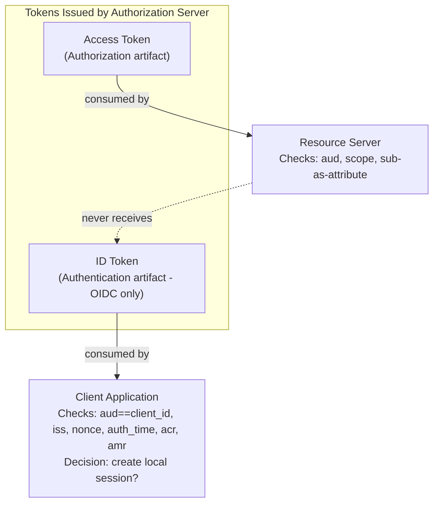
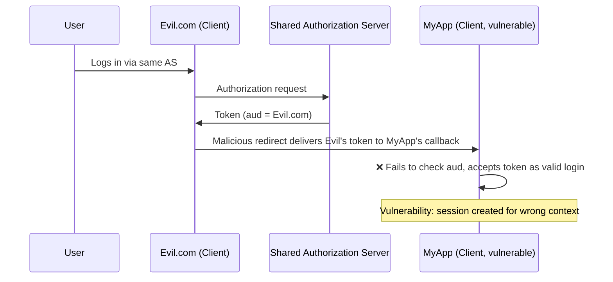
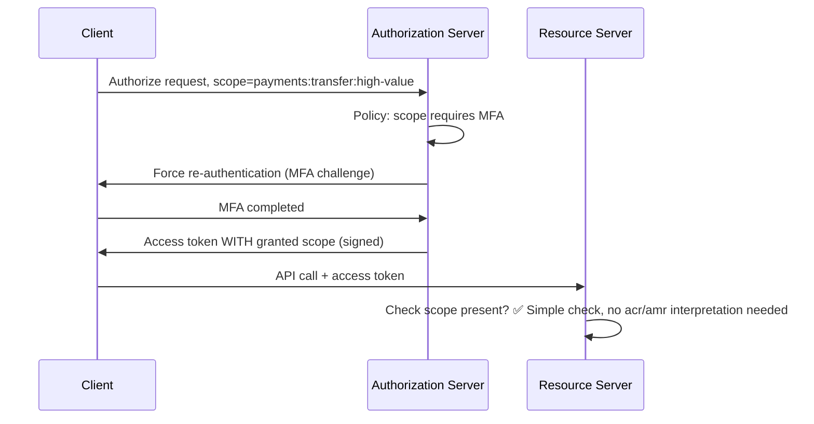

# Topic 1: OAuth 2.0 & OIDC Foundations

## 1. Introduction

OAuth 2.0 (RFC 6749) is a **delegated authorization** framework — it allows a **Client** application to obtain limited access to a **Resource Owner's** resources on a **Resource Server**, without ever handling the Resource Owner's credentials, and without the Client needing to know *who* the Resource Owner actually is. OAuth2 answers the question **"what is this bearer allowed to do?"** — it deliberately does not answer **"who is this person, and how strongly did they prove it?"**

**OpenID Connect (OIDC)** is a thin, standardized **identity layer built on top of OAuth2**. It reuses OAuth2's flows (Authorization Code, etc.) but adds a new artifact — the **ID Token** — plus supporting mechanisms (UserInfo endpoint, standardized identity/authentication claims, Discovery) specifically to answer the authentication question that OAuth2 leaves open.

Understanding *why* this separation exists — and where the boundary lies — is the foundation for every architectural decision covered in the rest of this curriculum (Keycloak, AWS, and Spring Security sections will each build on this core model).

## 2. Core Concepts (as derived through our discussion)

### 2.1 Authentication vs. Authorization — and where OAuth2 fits
- **Authentication** = "Who are you?" (proving identity)
- **Authorization** = "What are you allowed to do?" (granting/checking permission)
- OAuth2's scope is **strictly authorization**. It intentionally does not standardize *how* the Authorization Server authenticates the Resource Owner (password form, MFA, biometrics, social login) — that's implementation-defined by the AS.
- This is precisely the gap OIDC exists to fill.

### 2.2 The Four OAuth2 Roles
| Role | Responsibility |
|---|---|
| **Resource Owner** | The user (or system) who owns the protected resource and grants consent |
| **Client** | The application requesting access; public (no secret, e.g. SPA/mobile) or confidential (can hold a secret, e.g. backend server); handles redirects, token storage/exchange |
| **Authorization Server (AS)** | Authenticates the Resource Owner, obtains consent, issues tokens |
| **Resource Server (RS)** | Hosts the protected resource; accepts and validates tokens to allow/deny access |

### 2.3 Why the Authorization Code Flow Exists
Instead of the Client directly collecting the Resource Owner's password (Basic Auth-style), the Authorization Code flow ensures:
- Credentials are entered **only** on the AS's own login surface — never seen by the Client.
- The Client only ever receives **tokens**, which represent the Resource Owner going forward, with a reduced/scoped blast radius compared to raw credentials.

### 2.4 Bearer Tokens — What They Actually Guarantee
- A bearer token (access token) is analogous to a **hotel keycard**: whoever *holds* it can use it. Possession = usage rights. There is **no built-in proof that the holder is the legitimate original recipient**.
- Security implication: if stolen (XSS, log leakage, malicious redirect), the thief can use it exactly as the legitimate holder could, with no extra proof needed. This drives requirements like TLS-everywhere, short expiry, secure storage, and motivates proof-of-possession extensions (DPoP, mTLS-bound tokens — covered in later security-hardening topic).
- Tokens can be **opaque** (random reference string, meaningless to the Client) or **JWT** (structured, signed, potentially claim-bearing). OAuth2 does **not** mandate a format — this is a deliberate design freedom.
  - **Opacity is fundamentally a client-side contract**: the Client must always treat the access token as opaque, regardless of actual format, since the AS could change formats without breaking the Client's contract.
  - The **Resource Server**, however, is free to interpret a JWT access token's claims directly if the AS is configured to embed them — this is a real architectural choice, not a spec requirement.

### 2.5 Token Validation Placement — Gateway vs. Service vs. Mesh
- **Gateway-level validation**: centralizes authorization concerns, blocks unauthorized access before it reaches the internal network — but creates a single trust boundary; anything past the gateway is implicitly trusted.
- **Service-level validation**: protects against threats originating *inside* the trusted network (defense in depth) — but naively done with opaque tokens, it creates a hard dependency (and potential SPOF) on the AS being reachable for every request.
- **JWT + JWKS mitigates the SPOF concern**: signature validation only requires the AS's public signing key (fetched from the JWKS endpoint and cached) — not a live call per request.
- **Service mesh** as a middle ground: validation logic is enforced at the service level (defense in depth preserved) without embedding that concern inside each service's own code (sidecar/proxy handles it).

### 2.6 Why "I Got a Token" ≠ "The User Is Logged In"
This is the central architectural pitfall covered in depth:

1. **Category error — machine identity vs. human identity**: Client Credentials grant issues a perfectly valid access token representing **no human resource owner at all**. If session-creation logic doesn't distinguish flow/grant type, a service account token could be mistaken for a human login.
2. **Audience/token-confusion attack**: In a shared AS/tenant setup (e.g., one Keycloak realm serving multiple client apps), tokens for *different* apps can be signed by the *same key*. Only the `aud` claim distinguishes "this token is for MyApp" vs. "this token is for Evil.com." If an app fails to check `aud`, a token legitimately issued for a different application could be mistakenly accepted as proof of login — a real vulnerability class.
   - `aud` validation for **ID tokens** is spec-mandated (OIDC Core) and is the Client's responsibility.
   - `aud` validation for **access tokens** is reinforced by RFC 9068 (JWT Profile for OAuth2 Access Tokens) and enforced by the Resource Server (or by the AS's introspection endpoint scoping correctly).
   - The expected `aud` value is a **static configuration value** each party already knows (the Client's own `client_id` for ID tokens; a pre-registered API/Resource-identifier for access tokens — e.g. Keycloak Audience Mapper, AWS Cognito Resource Server identifier).
3. **No standardized authentication metadata in plain access tokens**: no guaranteed `auth_time`, `acr`, `amr` — meaning no reliable way to answer "was this a fresh login," "was MFA used," without OIDC's ID token.

**Resulting rule of thumb**: *Access token → authorization decisions on a Resource Server. ID token → authentication decisions in the Client (session creation).* Never use an access token alone to decide "is this user logged in."

### 2.7 OIDC's Identity Layer — the ID Token
The ID Token is a JWT specifically designed for **Client consumption** (never sent to a Resource Server) that standardizes:

| Claim | Meaning |
|---|---|
| `sub` | Stable, unique subject identifier for the user (the correct "user ID" to persist — never `email`/`name`) |
| `iss` | Issuer — which AS/tenant/realm vouches for this token |
| `aud` | Must equal the Client's own `client_id` — mandatory check, prevents audience mix-up |
| `auth_time` | When the actual authentication event occurred (may differ from token issuance time, e.g. SSO session reuse) |
| `acr` | Authentication Context Class Reference — AS-defined strength indicator (e.g., password-only vs. password+MFA) |
| `amr` | Authentication Methods References — array of actual methods used, e.g. `["pwd","otp"]` |
| `exp`, `iat`, `nbf` | Standard lifetime claims |
| `nonce` | Replay protection, echoes value sent in the original auth request |
| `name`, `email`, `email_verified`, `preferred_username`, `picture`, `locale` | Profile/display claims (note: an unverified email must not be trusted for account linking) |

The **UserInfo endpoint** (OIDC-defined, not core OAuth2) is a related, Client-facing mechanism: the Client calls it using the access token as a bearer credential to fetch fuller profile claims not included in a deliberately minimal ID token.

### 2.8 How a Resource Server Gets Identity/Authentication-Strength Info (Without Being the Client)
Three real architectural options, in order of increasing sophistication:

- **Option A — Rich JWT access tokens**: The AS is configured (via claim/protocol mappers) to embed `acr`, `amr`, `sub`, or custom claims directly into the *access token* itself. RS reads them with no network call. Common in real deployments.
- **Option B — Introspection (RFC 7662)**: For opaque tokens, the RS calls the AS's `/introspect` endpoint; the AS returns `active: true/false` plus whatever claims it's configured to expose. This is the RS-side equivalent of what UserInfo is for the Client.
- **Option C — Push the decision to the AS via scopes (preferred architectural pattern for step-up auth)**: Rather than having every RS interpret `acr`/`amr` semantics, the Client requests a specific scope (e.g. `payments:transfer:high-value`) at authorization time. The AS's policy ties that scope to a required authentication strength and forces re-authentication/MFA if not already satisfied. The AS **only issues the scope in the token if the requirement was actually met** — the Client cannot forge this, since the AS's signature over the token is tamper-evident. The RS then only needs to check for the presence of the scope — a simple, centralized, non-duplicated authorization check.

### 2.9 Opaque Tokens vs. JWTs — Full Trade-off Analysis
| Concern | JWT (self-contained) | Opaque + Introspection |
|---|---|---|
| RS↔AS coupling per request | None (stateless) | Required (network call) |
| Revocation immediacy | Weak (valid until `exp` unless a deny-list is added) | Strong (instant — AS marks it dead, introspection reflects it immediately) |
| Claim freshness | Snapshot at issuance (can go stale mid-session, e.g. role changes) | Always live/current |
| Validation complexity/risk | Distributed to every RS (crypto correctness risk, e.g. `alg:none` attacks) | Centralized at AS (one hardened implementation) |
| Scalability under high RPS | Better (no AS round-trip) | Worse (AS becomes a scaling/availability dependency) |
| Typical fit | High-throughput public APIs, microservices | Regulated/compliance-heavy systems requiring instant revocation |
| Common hybrid | Short-lived JWT access tokens (e.g. 5 min) + refresh token checked live against AS state on each refresh — used by Keycloak/Cognito by default | — |

### 2.10 Resolving the Apparent Identity/Authorization Paradox at the Resource Server
Scenario: `PATCH /orders/{orderId}` — RS must ensure the caller owns the order.

- RS validates token validity first (signature+expiry for JWT, or introspection result for opaque).
- RS checks `aud` matches its own registered identifier (defense against audience confusion).
- RS checks `scope`/role claims to confirm the bearer is permitted to perform `PATCH` on orders at all (coarse-grained authorization).
- RS compares the token's `sub` value against the order's stored `ownerId` (fine-grained, resource-level authorization).
- **No ID token is involved** — the ID token is Client-only; the RS relies entirely on the access token's claims or the introspection response.

**Key resolution**: `sub` is an OIDC/identity-shaped claim, but when a Resource Server uses it purely to compare against a stored owner identifier, it is functioning as an **authorization attribute**, not an authentication mechanism. The RS never asks "who is this person" (name, verification method) — only "does this bearer's identifier match the resource's recorded owner." This is **Attribute-Based Access Control (ABAC)**: `sub`, `scope`, `tenant_id`, `role` are all just attributes fed into a policy decision, none of which require the RS to perform authentication.

## 3. Diagrams

### 3.1 The Four Roles and Token Flow (Conceptual)
```mermaid
flowchart LR
    RO["Resource Owner<br/>(User)"] -->|authenticates & consents| AS["Authorization Server"]
    C["Client<br/>(Public/Confidential)"] -->|1. redirect to authorize| AS
    AS -->|2. authorization code| C
    C -->|3. exchange code| AS
    AS -->|4. access token + refresh token<br/>(+ ID token if OIDC)| C
    C -->|5. access token as bearer| RS["Resource Server"]
    RS -->|6. validate token<br/>allow/deny| C
```

### 3.2 Access Token vs. ID Token — Purpose Boundary


### 3.3 Audience Confusion Attack (Why `aud` Validation Matters)


### 3.4 Option C — Step-Up Authentication via Scope Request


## 4. Glossary

| Term | Definition |
|---|---|
| **OAuth 2.0** | Delegated authorization framework (RFC 6749); governs how a Client obtains limited access to a resource on behalf of a Resource Owner |
| **OIDC (OpenID Connect)** | Identity layer built on top of OAuth2; adds the ID Token, UserInfo endpoint, and standardized identity/authentication claims |
| **Resource Owner** | The user/entity who owns the protected resource |
| **Client** | The application requesting access; public (no secret) or confidential (can hold a secret) |
| **Authorization Server (AS)** | Authenticates the Resource Owner and issues tokens |
| **Resource Server (RS)** | Hosts the protected resource; validates tokens to grant/deny access |
| **Access Token** | Bearer credential authorizing API calls; format not mandated by spec (opaque or JWT) |
| **Refresh Token** | Long-lived credential used to obtain new access tokens without re-authenticating |
| **ID Token** | OIDC-specific JWT proving authentication occurred; Client-facing only, never sent to a Resource Server |
| **Bearer Token** | A token usable by whoever possesses it — no built-in proof of legitimate ownership |
| **Opaque Token** | A token with no inherent structure/meaning to the Client; requires introspection to interpret |
| **JWT (JSON Web Token)** | Structured, signed (and optionally encrypted) token format; can carry claims readable by any party with the verification key |
| **JWKS (JSON Web Key Set)** | Endpoint exposing the AS's public keys, used to verify JWT signatures without a live AS call per request |
| **Introspection (RFC 7662)** | AS endpoint (`/introspect`) that a Resource Server calls to check an opaque (or JWT) token's validity and claims |
| **UserInfo Endpoint** | OIDC endpoint the Client calls (using the access token) to fetch additional identity claims |
| **`sub`** | Subject claim — stable, unique identifier for the authenticated entity |
| **`aud`** | Audience claim — identifies the intended recipient (Client `client_id` for ID tokens; API/resource identifier for access tokens) |
| **`iss`** | Issuer claim — identifies which AS/tenant/realm issued the token |
| **`auth_time`** | Timestamp of the actual authentication event |
| **`acr`** (Authentication Context Class Reference) | AS-defined indicator of authentication strength |
| **`amr`** (Authentication Methods References) | Array of the specific authentication methods used (e.g., `pwd`, `otp`, `fido`) |
| **`nonce`** | Value echoed in the ID token to prevent replay attacks |
| **Audience/Token Confusion Attack** | Exploit where a token valid for one Client/RS is mistakenly accepted by another due to missing `aud` validation |
| **Client Credentials Grant** | OAuth2 grant for machine-to-machine auth; no human Resource Owner involved |
| **Step-Up Authentication** | Forcing stronger authentication (e.g., MFA) mid-session for sensitive operations, typically triggered via scope/`acr_values`/`claims` request parameters |
| **ABAC (Attribute-Based Access Control)** | Authorization model where claims/attributes (e.g., `sub`, `scope`, `tenant_id`) are evaluated against policy, without requiring the evaluator to "know" the user in an identity sense |
| **RFC 9068** | JWT Profile for OAuth 2.0 Access Tokens — standardizes claims like `aud` for access tokens |
| **DPoP / mTLS-bound tokens** | Extensions moving away from pure bearer semantics toward proof-of-possession (covered in later security topic) |