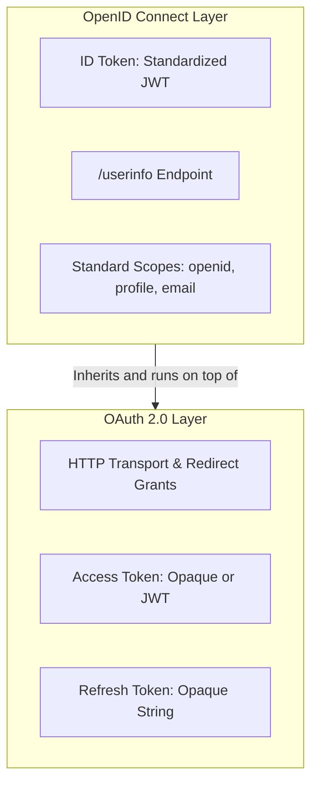
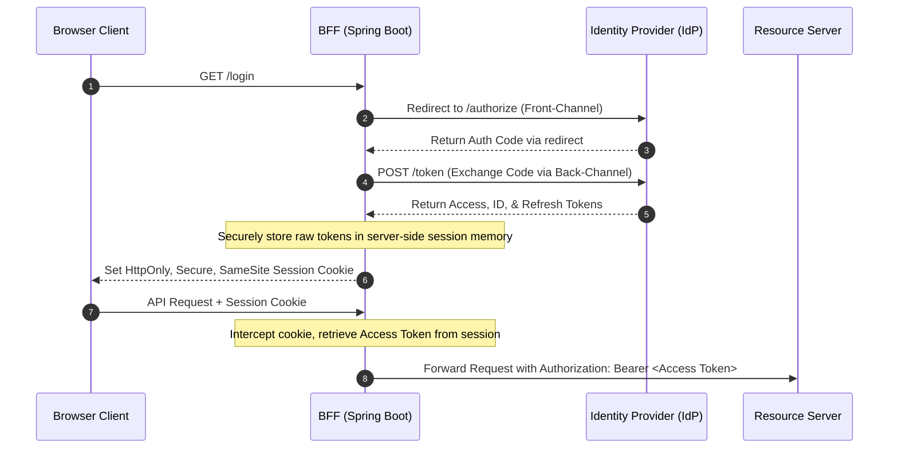

# OAuth & OICD

### 1. Conceptual Deep-Dive & Core Paradigm Shift

#### Delegated Authorization vs. Authentication

- **OAuth 2.0 (Delegated Authorization):** A transport protocol (RFC 6749) designed to issue access permissions (Access Tokens) to third-party client applications without exposing user credentials. It operates like a hotel valet key or keycard; it grants access to specific resources but does not verify identity. The content and format of the Access Token are completely unspecified (treated as a black-box string).
- **The Limitations of Core OAuth 2.0:** Under the original OAuth 2.0 specification, the format and content of the Access Token are completely unspecified. It is treated as an opaque string. This lack of standardization meant that there was no native way for a Resource Server to validate a token or retrieve identity details (such as a user's email or name) across different vendor implementations without custom, proprietary integration logic.
- **OpenID Connect (OIDC):** An identity layer built directly on top of the OAuth 2.0 framework. It standardizes identity representation by introducing the **ID Token** (which must always be a JSON Web Token / JWT), standard scopes (like `openid`, `profile`, `email`), and a standardized `/userinfo` endpoint. OIDC is effectively OAuth 2.0 plus a standardized method to extract and exchange identity claims.

#### Protocol Boundaries & Authorization Decisions (The Bartender Analogy)

OIDC standardizes the transport of verified identity attributes, but the ultimate authorization decision logic remains **outside** the protocol boundaries.

- **Inside the Protocol:** The Identity Provider (IdP) cryptographically asserts user claims (e.g., signing a JWT payload showing the user's birthdate is `1995-04-12`).
- **Outside the Protocol:** The Resource Server (acting like a bartender checking an ID card) reads these trusted, tamper-proof claims and executes its own internal business logic (e.g., `if (age < 21) reject()`) to grant or deny access.

#### Handling Opaque Tokens under OIDC

While OIDC mandates that the **ID Token** must be a readable JWT for the client, the **Access Token** can remain completely opaque to the outside world. When an opaque Access Token is utilized:

- The content of the token remains unknown to the client and transit intermediaries.
- The Resource Server cannot validate the token statelessly. It must query the Authorization Server's standardized **UserInfo Endpoint** or use **Token Introspection (RFC 7662)**, exchanging the opaque token for the corresponding user claims.

#### User Consent ("User Approves App Access")

In the delegation model, the Resource Owner (User) must explicitly consent to the scopes requested by the Client application. This is the runtime user interface prompt (e.g., *"This application would like to view your calendar and email address"*). This step establishes the security boundary, ensuring the Client only receives tokens authorized for those specific, approved scopes.

#### Actors, Identity Providers (IdP), and Social Federation

The ecosystem consists of four standard actors: the **Resource Owner** (User), the **Client** (App), the **Resource Server** (API), and the **Authorization Server/Identity Provider**.

- **Authorization Server (AS):** The OAuth 2.0 engine responsible for validating clients, executing grants, and issuing tokens.
- **Identity Provider (IdP):** The OIDC/SAML directory responsible for storing user credentials, authenticating users, and managing profiles. (Modern products like Keycloak or AWS Cognito act as both AS and IdP).
- **Social Sign-In (Identity Federation):** Social providers (such as Google or Facebook) act as external IdPs. In this setup, your primary Authorization Server (e.g., Keycloak) acts as a *Client* to Google. The user authenticates at Google, Google returns an ID Token to Keycloak, and Keycloak maps those attributes into a new local session and token issued to your internal applications.

------

### 2. Token Routing & Multi-Tier Validation Architecture

#### Stateless Access Control on the Resource Server

To maintain a high-performance, stateless microservice mesh, Resource Servers must avoid calling the IdP on every request. This is achieved by utilizing **JWT Access Tokens**:

1. The Authorization Server injects identity claims (like `roles` or custom user attributes) directly into the Access Token.
2. It signs the Access Token using its asymmetric **private key**.
3. The Resource Server caches the IdP's public keys from the **JWKS (JSON Web Key Set)** endpoint.
4. The Resource Server validates the incoming signature locally in memory. If the signature matches, the Resource Server trusts the claims statelessly and executes local access control without any database or network lookups.

#### The Backend For Frontend (BFF) Pattern

Storing raw tokens directly in browser storage (LocalStorage/SessionStorage) makes them vulnerable to exfiltration via **Cross-Site Scripting (XSS)**. The **BFF Pattern** mitigates this by shifting token management to a secure, server-side web component.

**Architectural Considerations of co-located Client/Resource Server architectures:**

- In classic Spring Boot MVC architectures where the Client and Resource Server are co-located in the same JVM, the client browser only maintains a secure server-side session cookie (`JSESSIONID`).
- The Spring backend handles the OAuth 2.0 authorization code exchange silently, storing the resulting tokens in the backend session.
- Even when co-located, internal security filters should validate the **Access Token** (not the ID Token) to authorize backend operations.
- The client component parses the **ID Token** solely to display user profile details in the UI and to construct the local server-side security context.

------

### 3. Glossary of Terms & Acronyms

| Acronym | Full Name | Definition |
| ------- | --------- | ---------- |
| **IdP**  | Identity Provider    | The system hosting user directories and profiles, responsible for verifying credentials (OIDC/SAML). |
| **AS**   | Authorization Server | The engine issuing OAuth 2.0 tokens based on authenticated authorization. |
| **RS**   | Resource Server      | The API hosting protected resources, validating Access Tokens to grant access. |
| **JWT**  | JSON Web Token       | A compact, URL-safe standard (RFC 7519) for representing signed JSON claims. |
| **BFF**  | Backend For Frontend | An architectural pattern that shifts token storage and session management from the browser to a secure backend. |
| **JWKS** | JSON Web Key Set     | An endpoint (`/.well-known/jwks.json`) that publishes public keys used to verify JWT signatures. |

------

### 4. Consolidated Knowledge Check Insights

- **Token Isolation Rules:** Access Tokens are for APIs; ID Tokens are for Clients. Parsing or trusting an ID Token at the Resource Server is an architectural anti-pattern because ID Tokens do not express access scopes and bypass the API's security filter boundaries.
- **BFF Session Management:** Moving to a BFF eliminates browser-side token theft but introduces the complexity of server-side state. Scaling this horizontally requires a fast, highly-available external session store (e.g., Redis) or sticky session routing, adding latency and infrastructural dependencies.